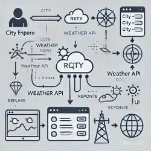

# 🌦️ Weather Application

A simple and responsive web application that provides real-time weather information for any city, built using plain **HTML**, **CSS**, and **JavaScript**.

---

## ✨ Features

- **Get Current Weather:** Users can search for and retrieve current weather details for any city.
- **Weather Details:** The app displays key weather information such as:
  - 🌡️ **Temperature** (Celsius/Fahrenheit)
  - 💧 **Humidity level**
  - 🌥️ **Weather condition** (Clear, Cloudy, etc.)
  - 🌬️ **Wind speed**
- **Responsive Design:** Fully responsive and optimized for both desktop and mobile devices.

---

## 🛠️ Technologies Used

- **HTML**: For structuring the web application.
- **CSS**: For styling the layout and ensuring a mobile-friendly design.
- **JavaScript**: For fetching and displaying weather data dynamically.
- **Weather API**: Fetches live weather data from the [Insert Weather API Name, e.g., OpenWeatherMap API].

---

## 📁 Project Structure

```
/root
  ├── /img
  │   └── *.img       # Contains all the images for the app
  ├── script.js           # Main JavaScript file for fetching and displaying weather data
  ├── index.html           # Main HTML file for the application
  ├── style.css            # Main Style file for the application
  ├── README.md            # Project documentation
````

## How It Works
1. Enter a City Name: The user inputs the name of a city into the search bar.
2. Fetch Weather Data: A request is sent to the weather API to fetch real-time weather information for the specified city.
3. Display Weather Details: The weather data (temperature, humidity, etc.) is displayed on the screen for the user to view.



## Installation & Usage
To run this project locally:
1. Clone the repository:
`
git clone https://github.com/yourusername/weather-app.git
`
2. Open the project folder:
`
cd weather-app
`
3. Open the index.html file in your browser to run the app:
`
open index.html
`

## Demo
Check out the live demo:

## Future Improvements
* Add a 5-day weather forecast feature.
* Include more weather details like UV index, pressure, and visibility.
* Improve UI with smoother animations and transitions.
* Allow users to toggle between Celsius and Fahrenheit units.

## Lessons Learned
* Learned how to work with JavaScript’s fetch API to interact with third-party services.
* Improved skills in handling asynchronous JavaScript and error handling.
* Strengthened understanding of building responsive web applications.

## Contributing
Feel free to fork this repository and submit pull requests if you’d like to contribute to the project!
## License
This project is open-source and available under the

## Contact
For any inquiries or feedback, you can reach me at [YourEmail@example.com] or connect with me on LinkedIn.
